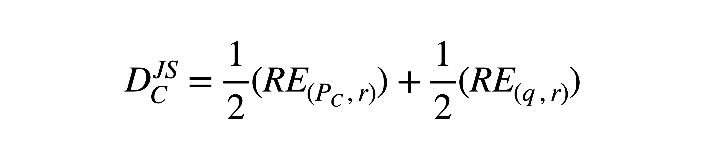
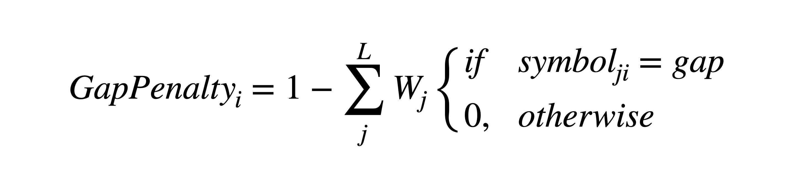
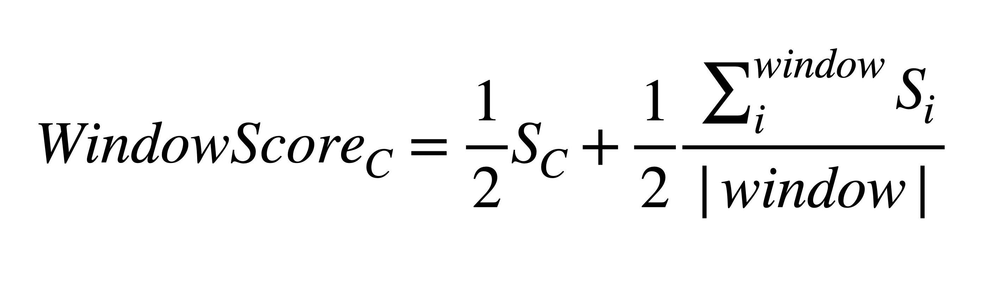

# Scoring residue evolutionaly conservation Capra07 

A Rust WebAssembly online web application that scores residue conservation a site in a Multiple Sequence Alignment ( MSA ) by using Jensen-Shannon divergence. 📦🦀 

### [GitHub Pages 👈](https://shin-kinos.github.io/cons-capra07-wasm/) 

## Description 

* This program scores residue conservation in each site of a MSA. 
* The scoring measure is based on Jensen-Shannon divergence ( JSD ) introduced by Capra and Singh [1]. 
* It takes account of background distribution, sequence weighting and gap penalty. 

## Scoring method 

### Conservation score 

The conservation score is calculated based on JSD as follows: 

 

where ***Pc*** is a site distribution, ***q*** is a background distribution, ***r = ( Pc + q ) / 2*** and ***RE*** is the Relative Entropy ( RE ). 

⚠️ NOTE that gaps are ignored in calculating site distributions.

### Sequence weighting 

This program supports 2 types of sequence weighting: 

1. The Position-Based method by Henikoff and Henikoff [2].
2. The Distance-Based method by Vingron and Argos [3]. 

### Gap penalty 

The simple gap penalty method is given as follows: 

 

where ***L*** is the length of a site ( or number of the sequences in the MSA ) and ***Wj*** is the weighting factor of sequence ***j***. The gap penalty of site ***i*** is given by calculating sum of weighting factors assigned to the gaps in sequence ***j***. 

### Background distribution 

The RE requires a background distribution. In this program, 9 background distributions are implemented as follows: 

1. BLOSUM62 [4] 
2. AA composition of Swiss-Prot ( from UniProt Knowledge Base ) 
3. AA composition in extracellular proteins [5]
4. AA composition in membrane proteins [5]
5. AA composition in intracellular proteins [5] 
6. JTT [6] 
7. WAG [7] 
8. LG [8] 
9. Non-biassed distribution ( equal rate at 0.05 )  

Gaps are ignored as well as site distributions. 

### Incorporating neighboring residues 

Positions near in space and sequence to functionally important residues are known to be more conserved than average. To take this tendency into account, a following method introduced by Capra and Singh [1] incorporates sequential neighboring sites to modify each score: 

 

where ***window*** represents the number of the neighboring sites on either side of site ***C***. And ***Sc*** and ***Si*** are conservation score of each site. 

## Usage 

#### Input file format 

The input file format MUST be Aligned Multi-FASTA that is constructed from amino acid sequences. 

⚠️ NOTE that nucleotide sequences are not supported. 

 

If you do not have an Aligned Multi-FASTA file that you aim to analyse and would like to use an example dataset, check `Use example dataset □`. 

Hover the mouse cursor over that `🤔` emoji marks to see much detailed information about them. 

### Options 

* `Background distribution` : Background distributions that are described above ( default BLOSUM62 ). 

* `Sequence weighting method` : Sequence weighting methods that are described above ( default Position-Based ). 

* `Tolerate non-standard residues` : If `Yes`, the program tolerates non-standard residues such as `B`, `Z` and `X` etc. in an input dataset by converting them into gap symbols. If `No`, the program halts anyway if an input dataset includes these non-standard residues ( default Yes ).

* `Colorize the scores` : It colorizes result conservation scores depending on their values to detect which score is higher or lower by giving them a color gradient. Hover the mouse cursor over that `🤔` emoji marks to see the list of color palettes and much detailed information about them ( default None ). 

* `Colorize the residues` : If `Yes`, each site composition is colorized based on the amino acid residues' 6 types of stereochemical propaty ( Yellow : Aliphatic ( A, V, L, I, M, C ), Cyan : Aromatic ( F, W, Y, H ), Green : Polar ( S, T, N, Q ), Blue : Positive ( K, R ), Red : Negative ( D, E ), Purple : Special conformations ( G, P ) ). Hover the mouse cursor over that `🤔` emoji marks to see the color palette ( default Yes ).   

## References 
1. Capra, John A., and Mona Singh. "Predicting functionally important residues from sequence conservation." Bioinformatics 23.15 (2007): 1875-1882.
2. Henikoff, Steven, and Jorja G. Henikoff. "Position-based sequence weights." Journal of molecular biology 243.4 (1994): 574-578. 
3. Vingron, Martin, and Patrick Argos. "A fast and sensitive multiple sequence alignment algorithm." Bioinformatics 5.2 (1989): 115-121. 
4. Henikoff, Steven, and Jorja G. Henikoff. "Amino acid substitution matrices from protein blocks." Proceedings of the National Academy of Sciences 89.22 (1992): 10915-10919. 
5. Cedano, Juan, et al. "Relation between amino acid composition and cellular location of proteins." Journal of molecular biology 266.3 (1997): 594-600. 
6. Jones, David T., William R. Taylor, and Janet M. Thornton. "The rapid generation of mutation data matrices from protein sequences." Bioinformatics 8.3 (1992): 275-282. 
7. Whelan, Simon, and Nick Goldman. "A general empirical model of protein evolution derived from multiple protein families using a maximum-likelihood approach." Molecular biology and evolution 18.5 (2001): 691-699. 
8. Le, Si Quang, and Olivier Gascuel. "An improved general amino acid replacement matrix." Molecular biology and evolution 25.7 (2008): 1307-1320. 

